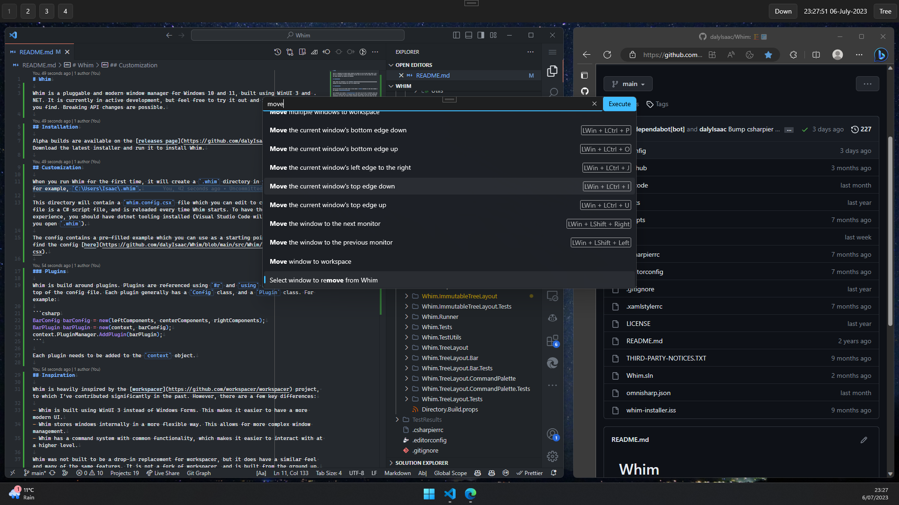

# Whim

Whim is a pluggable and modern window manager for Windows 10 and 11, built using WinUI 3 and .NET. It is currently in active development, but feel free to try it out and report any issues you find. Breaking API changes are possible.



## Installation

Alpha builds are available on the [releases page](https://github.com/dalyIsaac/Whim/releases). Download the latest installer and run it to install Whim.

## Customization

When you run Whim for the first time, it will create a `.whim` directory in your user profile - for example, `C:\Users\Isaac\.whim`.

This directory will contain a `whim.config.csx` file which you can edit to customize Whim. This file is a C# script file, and is reloaded every time Whim starts. To have the best development experience, you should have dotnet tooling installed (Visual Studio Code will prompt you when you open `.whim`).

The config contains a pre-filled example which you can use as a starting point. You can also find the config [here](https://github.com/dalyIsaac/Whim/blob/main/src/Whim/Template/whim.config.csx).

### Plugins

Whim is build around plugins. Plugins are referenced using `#r` and `using` statements at the top of the config file. Each plugin generally has a `Config` class, and a `Plugin` class. For example:

```csharp
BarConfig barConfig = new(leftComponents, centerComponents, rightComponents);
BarPlugin barPlugin = new(context, barConfig);
context.PluginManager.AddPlugin(barPlugin);
```

Each plugin needs to be added to the `context` object.

## Inspiration

Whim is heavily inspired by the [workspacer](https://github.com/workspacer/workspacer) project, to which I've contributed significantly in the past. However, there are a few key differences:

- Whim is built using WinUI 3 instead of Windows Forms. This makes it easier to have a more modern UI.
- Whim stores windows internally in a more flexible way. This allows for more complex window management.
- Whim has a command system with common functionality, which makes it easier to interact with at a higher level.
- Creating subclasses of internal classes is not encouraged in Whim - instead, plugins should suffice to add new functionality.

Whim was not built to be a drop-in replacement for workspacer, but it does have a similar feel and many of the same features. It is not a fork of workspacer, and is built from the ground up.

I am grateful to the workspacer project for the inspiration and ideas it has provided.

## Architecture

> In progress...

### Layouts

This is one of the key differences between workspacer and Whim. Currently, workspacer stores all windows in an [`IEnumerable<IWindow>`](https://github.com/workspacer/workspacer/blob/17750d1f84b8bb9015638ee7a733a2976ce08d25/src/workspacer.Shared/Workspace/Workspace.cs#L10) stack which is passed to each [`ILayout` implementation](https://github.com/workspacer/workspacer/blob/17750d1f84b8bb9015638ee7a733a2976ce08d25/src/workspacer.Shared/Layout/ILayoutEngine.cs#L23).

In comparison, layout engines in Whim store windows themselves, and do not require [`IEnumerable<IWindow>` to be passed to them](https://github.com/dalyIsaac/Whim/blob/3ba4d42502732826903522d51e51d55fd0edb6d7/src/Whim/Layout/ILayoutEngine.cs#L8). This allows for more complex layouts, and also allows for more complex window management. For example, the `TreeLayoutEngine` uses a n-ary tree structure to store windows, which allows for arbitrary grid layouts.

## Contributing

Please file an issue if you find any bugs or have any feature requests. Pull requests are welcome, but please file an issue first to discuss the change you'd like to make.

Work is currently being tracked in the [project board](https://github.com/users/dalyIsaac/projects/2/views/7).
