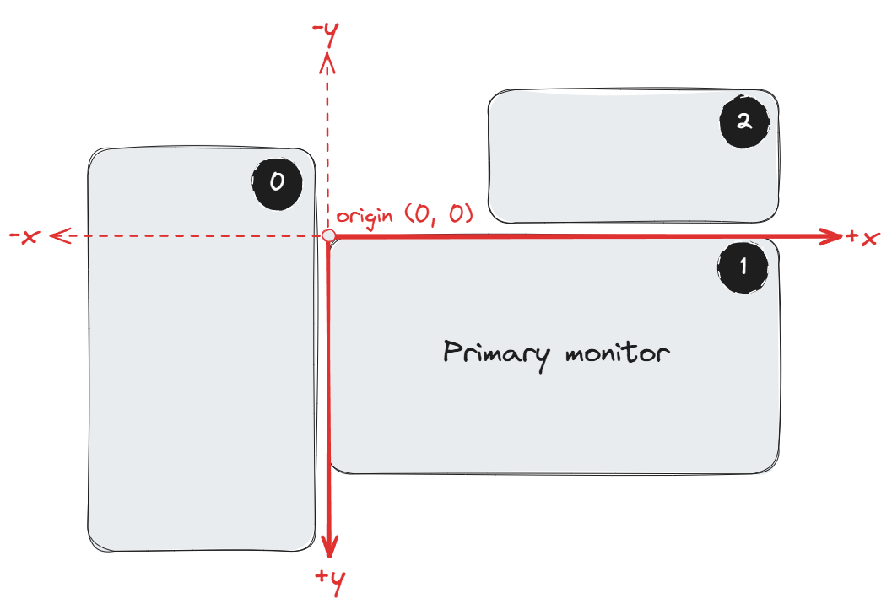

# Monitors

A "monitor" in Whim is a display connected to the Windows. The positioning and sizing of monitors in Whim matches the layout of monitors in Windows.

Whim stores monitors in the as an ordered list, depending on their coordinates in Windows. Your **primary** monitor will have the top-left coordinate by `(0, 0)`. Monitors are ordered by their `x`-coordinate first, then by their `y`-coordinate.

For example, the ordering (with 0-based indexing) of the monitor configuration below is `0, 1, 2`, as indicated by the numbers in the top-right corner of each monitor:

