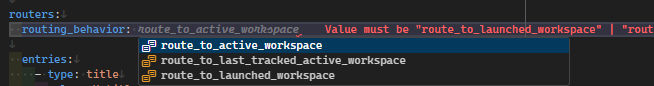

# YAML/JSON Configuration

Whim can be configured using YAML or JSON. The configuration file should be named `whim.config.yaml` or `whim.config.json` and should be placed in the root of your `.whim` directory.

Configuration options can be found in the pages to the left.

Integration with C# scripting is also possible - see [YAML/JSON and C# integration](../script/snippets.md#yamljson-and-c-integration).

## Schema

Whim's YAML and JSON configuration is validated using a JSON schema, which provides autocompletion and validation in supported text editors, like Visual Studio Code.



The schema can be found in your Whim installation at `WHIM_PATH/plugins/Whim.Yaml/schema.json` (replace `WHIM_PATH` with the path to your Whim installation). The latest schema is available [here](https://raw.githubusercontent.com/dalyIsaac/Whim/main/src/Whim.Yaml/schema.json).

To use the schema in your YAML file, add the following line at the top of your file:

```yaml
# yaml-language-server: $schema=WHIM_PATH/plugins/Whim.Yaml/schema.json
```

To use the schema in your JSON file, add the following line at the top of your file:

```json
{
  "$schema": "WHIM_PATH/plugins/Whim.Yaml/schema.json",
  ...
}
```

## Errors

Whim will make a best effort to load the parts of the configuration that are valid, even if there are errors in other parts of the configuration. Errors will be shown in:

- your text editor (provided your text editor supports YAML/JSON validation)
- a window that opens when Whim starts
- log files in your `.whim` directory
