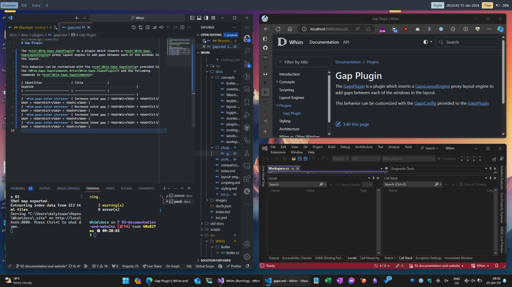

# Gaps Plugin

The <xref:Whim.Gaps.GapsPlugin> adds the config and commands for the <xref:Whim.Gaps.GapsLayoutEngine> proxy layout engine to add gaps between each of the windows in the layout.



This behavior can be customized with the <xref:Whim.Gaps.GapsConfig> provided to the <Whim.Gaps.GapsCommands.#ctor(Whim.Gaps.IGapsPlugin)>.

## Example Config

```csharp
#r "WHIM_PATH\whim.dll"
#r "WHIM_PATH\plugins\Whim.Gaps\Whim.Gaps.dll"

using Whim;
using Whim.Gaps;

void DoConfig(IContext context)
{
  // ...

  GapsConfig gapsConfig = new() { OuterGap = 10, InnerGap = 10 };
  GapsPlugin gapsPlugin = new(context, gapsConfig);
  context.PluginManager.AddPlugin(gapsPlugin);

  // ...
}

return DoConfig;
```

## Commands

| Identifier                 | Title              | Keybind                                                            |
| -------------------------- | ------------------ | ------------------------------------------------------------------ |
| `whim.gaps.outer.increase` | Increase outer gap | <kbd>Win</kbd> + <kbd>Ctrl</kbd> + <kbd>Shift</kbd> + <kbd>L</kbd> |
| `whim.gaps.outer.decrease` | Decrease outer gap | <kbd>Win</kbd> + <kbd>Ctrl</kbd> + <kbd>Shift</kbd> + <kbd>H</kbd> |
| `whim.gaps.inner.increase` | Increase inner gap | <kbd>Win</kbd> + <kbd>Ctrl</kbd> + <kbd>Shift</kbd> + <kbd>K</kbd> |
| `whim.gaps.inner.decrease` | Decrease inner gap | <kbd>Win</kbd> + <kbd>Ctrl</kbd> + <kbd>Shift</kbd> + <kbd>J</kbd> |
