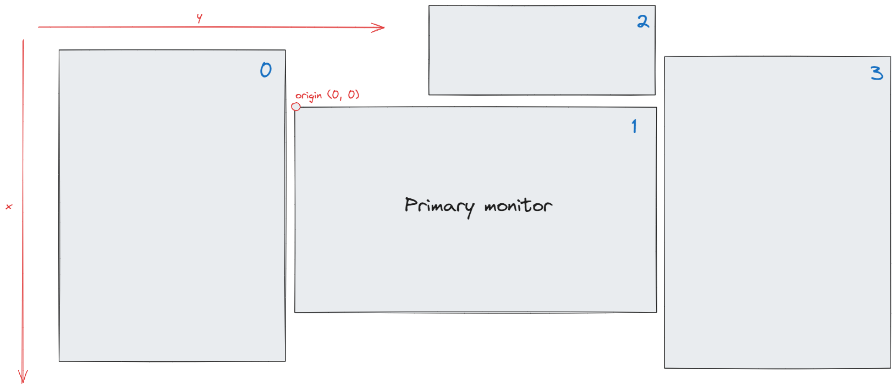

# Monitors

A "monitor" or <xref:Whim.IMonitor> in Whim is a display connected to the Windows. The positioning and sizing of monitors in Whim matches the layout of monitors in Windows.

Whim stores monitors in the <xref:Whim.IMonitorSector> as an ordered list. The order of the monitors in the list depends on their coordinates in Windows. Your **primary** monitor will have the top-left coordinate by `(0, 0)`. Monitors are ordered by their `x`-coordinate first, then by their `y`-coordinate.

For example, the ordering (with 0-based indexing) of the monitor configuration below is `0, 1, 2`, as indicated by the numbers in the top-right corner of each monitor:



To interact with the monitors, use the monitor pickers from the <xref:Whim.Pickers> to retrieve them from the store. For more on how to use the store, see the [Store](./store.md) page.

## Example Command

```csharp
Guid browserWorkspaceId = context.Store.Dispatch(new AddWorkspaceTransform("Browser")).Value;
Guid ideWorkspaceId = context.Store.Dispatch(new AddWorkspaceTransform("IDE")).Value;

context.CommandManager.Add(
    "move_last_focused_browser_window_to_first_monitor",
    "Move last focused browser window to the first monitor",
    () => {
        if (!context.Store.Pick(Pickers.PickMonitorsByIndex(0)).TryGet(out IMonitor firstMonitor))
        {
            return;
        }

        if (!context.Store.Pick(Pickers.PickLastFocusedWindowHandle(browserWorkspaceId)).TryGet(out HWND lastFocusedWindowHandle))
        {
            return;
        }

        context.Store.Dispatch(new MoveWindowToMonitorTransform(lastFocusedWindowHandle, firstMonitor.Handle));
    }
);
```

For more, see the [Store](./store.md) and [Commands](./commands.md) pages.
