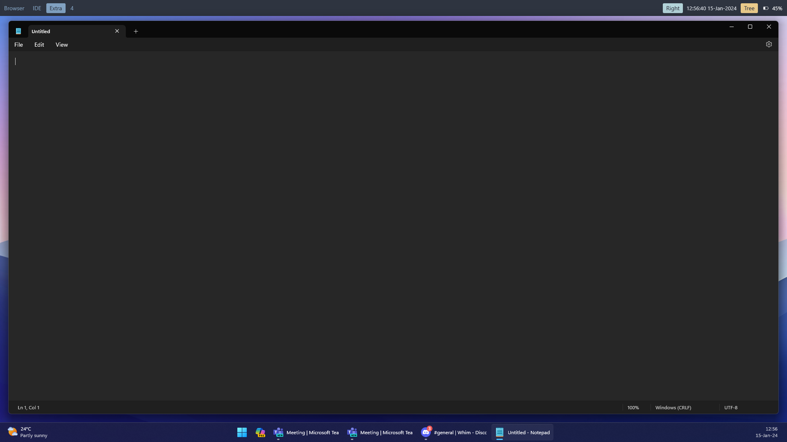

# Bar Plugin

The <xref:Whim.Bar.BarPlugin> adds a configurable bar at the top of a screen.



## Configuration

The <xref:Whim.Bar.BarConfig> takes in three lists of <xref:Whim.Bar.BarComponent>s in its constructor. These correspond to the left, center, and right components on the bar.

The bar can be styled using XAML - see [Styling](../customize/styling.md).

> [!NOTE]
> The height of the bar can be configured the XAML styling. However, [BarConfig.Height](xref:Whim.Bar.BarConfig.Height) takes precedence over the height specified in the XAML.

## Available Widgets

When creating a component, use the `CreateComponent` method on the widget class. For example:

```csharp
List<BarComponent> leftComponents = new() { WorkspaceWidget.CreateComponent() };
List<BarComponent> centerComponents = new() { FocusedWindowWidget.CreateComponent() };
List<BarComponent> rightComponents = new()
{
  BatteryWidget.CreateComponent(),
  ActiveLayoutWidget.CreateComponent(),
  DateTimeWidget.CreateComponent(),
};
```

- [ActiveLayoutWidget](xref:Whim.Bar.ActiveLayoutWidget.CreateComponent)
- [BatteryWidget](xref:Whim.Bar.BatteryWidget.CreateComponent)
- [DateTimeWidget](<xref:Whim.Bar.DateTimeWidget.CreateComponent(System.Int32,System.String)>)
- [FocusedWindowWidget](<xref:Whim.Bar.FocusedWindowWidget.CreateComponent(System.Func{Whim.IWindow,System.String})>)
- [WorkspaceWidget](xref:Whim.Bar.WorkspaceWidget.CreateComponent)

## Example Config

```csharp
#r "WHIM_PATH\whim.dll"
#r "WHIM_PATH\plugins\Whim.Bar\Whim.Bar.dll"

using Whim;
using Whim.Bar;

void DoConfig(IContext context)
{
  // ...

  List<BarComponent> leftComponents = new() { WorkspaceWidget.CreateComponent() };
  List<BarComponent> centerComponents = new() { FocusedWindowWidget.CreateComponent() };
  List<BarComponent> rightComponents = new()
  {
    BatteryWidget.CreateComponent(),
    ActiveLayoutWidget.CreateComponent(),
    DateTimeWidget.CreateComponent(),
  };

  BarConfig barConfig = new(leftComponents, centerComponents, rightComponents);
  BarPlugin barPlugin = new(context, barConfig);
  context.PluginManager.AddPlugin(barPlugin);

  // ...
}

return DoConfig;
```

## Commands

N/A
