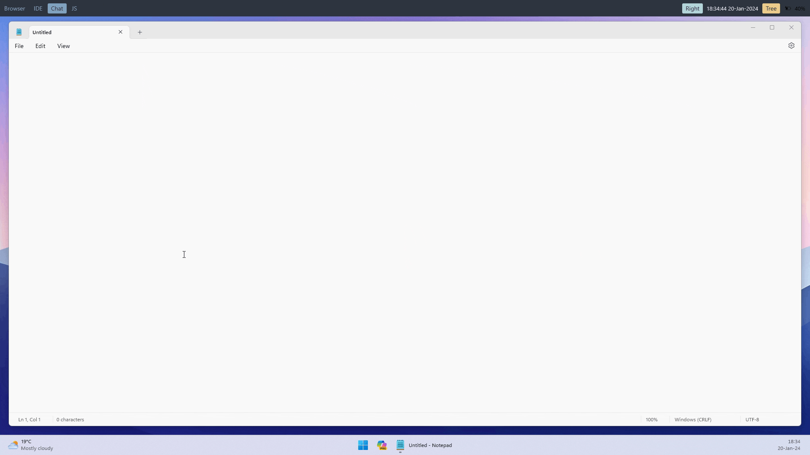

# Command Palette Plugin

The <xref:Whim.CommandPalette.CommandPalettePlugin> provides a fuzzy command palette, loaded with all the <xref:Whim.ICommand>s registered with the <xref:Whim.ICommandManager>.

The command palette uses a port of Visual Studio Code's fuzzy search algorithm.



## Configuration

The <xref:Whim.CommandPalette.CommandPaletteConfig> can be used to configure the command palette. The <xref:Whim.CommandPalette.CommandPaletteConfig.ActivationConfig> can be used to configure the default commands and matcher to use.

Custom instances of the command palette can be activated by calling <xref:Whim.CommandPalette.CommandPalettePlugin.Activate(Whim.CommandPalette.BaseVariantConfig)>.

## Example Config

```csharp
#r "WHIM_PATH\whim.dll"
#r "WHIM_PATH\plugins\Whim.CommandPalette\Whim.CommandPalette.dll"

using Whim;
using Whim.CommandPalette;

void DoConfig(IContext context)
{
  // ...

  CommandPaletteConfig commandPaletteConfig = new(context);
  CommandPalettePlugin commandPalettePlugin = new(context, commandPaletteConfig);
  context.PluginManager.AddPlugin(commandPalettePlugin);

  // ...
}

return DoConfig;
```

[!INCLUDE [Commands](../../_includes/plugins/command-palette.md)]
