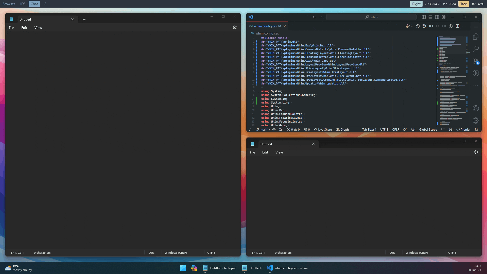

# Layout Preview Plugin

The <xref:Whim.LayoutPreview.LayoutPreviewPlugin> adds a preview of the next layout when the user drags a window.

The <xref:Whim.LayoutPreview.LayoutPreviewPlugin> has no configuration options.



## Things to Note

- When there are multiple possible rectangles which could contain a window, the preview will highlight the first rectangle which contains the mouse.
- The layout preview will not show the preview colors if the setting `Transparency effects` in Windows is turned off.

## Example Usage

```csharp
#r "WHIM_PATH\plugins\Whim.LayoutPreview\Whim.LayoutPreview.dll"

using Whim;
using Whim.LayoutPreview;

void DoConfig(IContext context)
{
  // ...

  LayoutPreviewPlugin layoutPreviewPlugin = new(context);
  context.PluginManager.AddPlugin(layoutPreviewPlugin);

  // ...
}

return DoConfig;

```

[!INCLUDE [Commands](../../_includes/plugins/layout-preview.md)]
